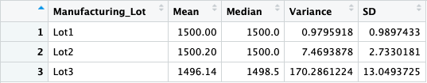
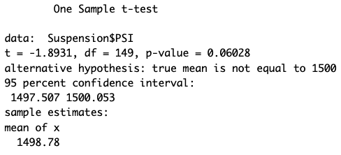
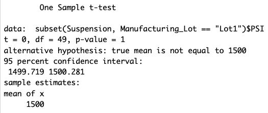
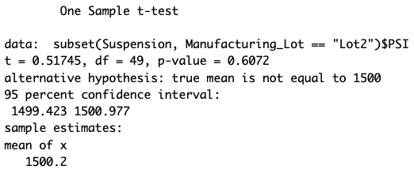

# MechaCar Statistical Analysis

## Linear Regression to Predict MPG
#### Linear Regression Summary:

#### - Which variables/coefficients provided a non-random amount of variance to the mpg values in the dataset?
- Upon review of the summary in the image above, both vehicle length and ground clearance variables have a p-values of 2.60e-12 and 5.21e-08, respectively. Since both of these p-values are less than 0.05, this means that both variables - vehicle length and ground clearance - provided a non-random amount of variance to the MPG values in the dataset.

#### - Is the slope of the linear model considered to be zero? Why or why not?
- No, the slope of this linear model is not zero. The p-value of the Intercept is 5.08e-08 - therefore we would reject the null hypothesis, and leading us to dertermine that the slope is not zero. 

#### - Does this linear model predict mpg of MechaCar prototypes effectively? Why or why not?
- Referring to the summary again, the this linear model has an r-squared value of 0.715. This result shows us that 71% of the variability is explained by the model. Therefore, we can determine that this linear model does effectively predict the MPG of MechaCar prototypes.

## Summary Statistics on Suspension Coils
#### Review of Total Summary Statistics:

#### Review of Respective Lot Statistics:

### Summary
This dataset provided information on the weight capacities of multiple suspension coils to review the consistency of the manufacturing process across different production lots. The first image above gives a broad view of the statistics of the dataset. In this first table, we can see the average PSI, the medain PSI, the variance of the data, and the standard deviation. 
In the second table, the same statistics from the first table is broken out between lots, giving a better view of the differences between each lot. 

***The design specifications for the MechaCar suspension coils dictate that the variance of the suspension coils must not exceed 100 pounds per square inch. Does the current manufacturing data meet this design specification for all manufacturing lots in total and each lot individually? Why or why not?***

The manufacturing data for ***ALL*** lots shows that the lots in combination meet the design specifications of the variance staying under 100 lbs per square inch. As seen in the Total Summary Statistics image, the variance is about 62.29.

The only lot whose variance does not meat the design specification is **Lot 3**. In fact, Lot 3's variance at 170.29, is much much higher than that of Lot 1 and 2's - 0.98 and 2.73, respectively. This shows that Lot 3 is severely underperforming in relation to Lot 1 and 2 - without Lot 3, the variance of the entire dataset would decrease dramatically. 

## T-Tests on Suspension Coils
#### Summary of t-Test Results Across All Lots

This summary shows us the true mean of the data: 1498.78. We also see that the p-value is 0.06, which is higher than 0.05, meaning we do not have enough evidence to reject the null hypothesis. Meaning, the PSI across all lots is not statistically different from the population mean of 1500 pounds per square inch.

#### Summary of t-Test Results for Lot 1

Lot 1 has a true sample mean of 1500, and a p-value of 1. As a result, we would also determine that we would fail to reject the null hypothesis in this case as well. 

#### Summary of t-Test Results for Lot 2

Lot 2 has a true sample mean of 1500.2, and a p-value of 0.61. Since the p-value is above 0.05, as with Lot 1, we would once again fail to reject the null hypothesis. 

#### Summary of t-Test Results for Lot 3

Lot 3 has a true sample mean of 1496.14 and a p-value of 0.04, which is lower than the significance level of 0.05. In this case, we would reject the null hypothesis that this sample mean and the population mean are not statistically different. 
