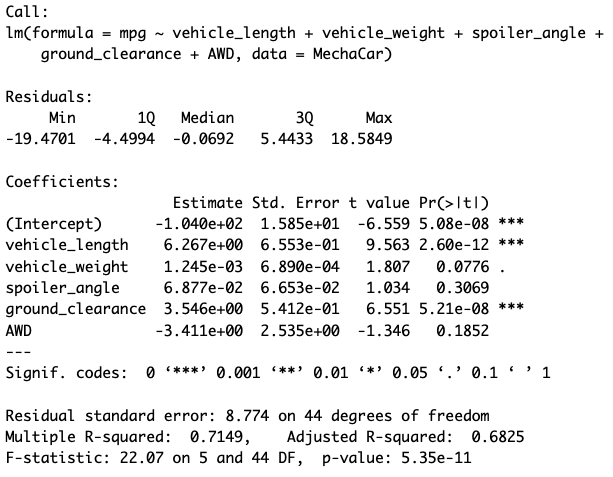

# MechaCar Statistical Analysis

## Linear Regression to Predict MPG

#### - Which variables/coefficients provided a non-random amount of variance to the mpg values in the dataset?
    - Upon review of the summary in the image above, both vehicle length and ground clearance variables have a p-values of 2.60e-12 and 5.21e-08, respectively. Since both of these p-values are less than 0.05, this means that both variables - vehicle length and ground clearance - provided a non-random amount of variance to the MPG values in the dataset.

#### - Is the slope of the linear model considered to be zero? Why or why not?
    - No, the slope of this linear model is not zero. The p-value of the Intercept is 5.08e-08 - therefore we would reject the null hypothesis, and leading us to dertermine that the slope is not zero. 

#### - Does this linear model predict mpg of MechaCar prototypes effectively? Why or why not?
    - Referring to the summary again, the this linear model has an r-squared value of 0.715. This result shows us that 71% of the variability is explained by the model. Therefore, we can determine that this linear model does effectively predict the MPG of MechaCar prototypes.
    
